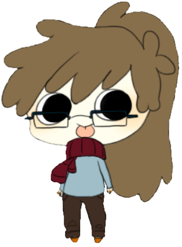
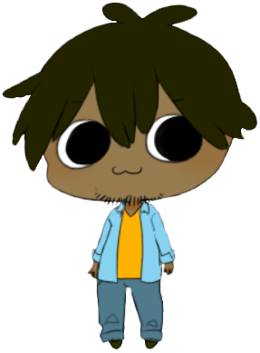
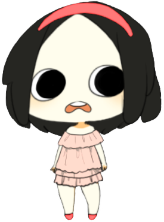
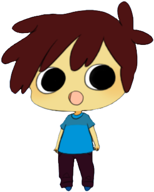
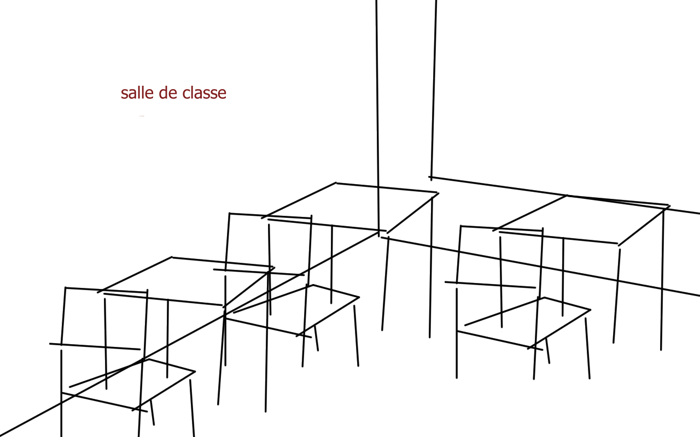
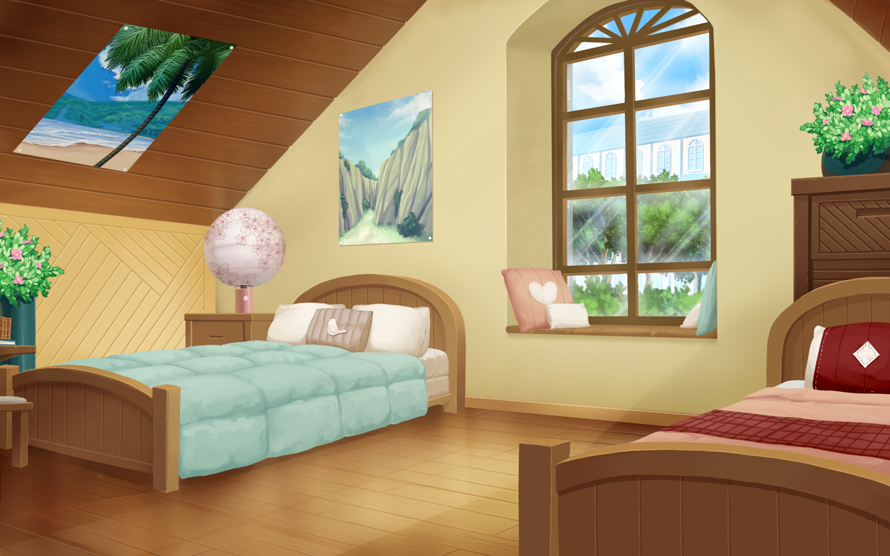
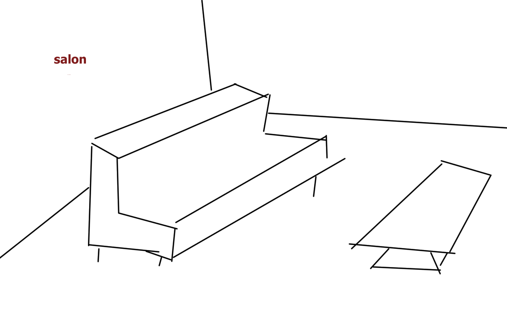
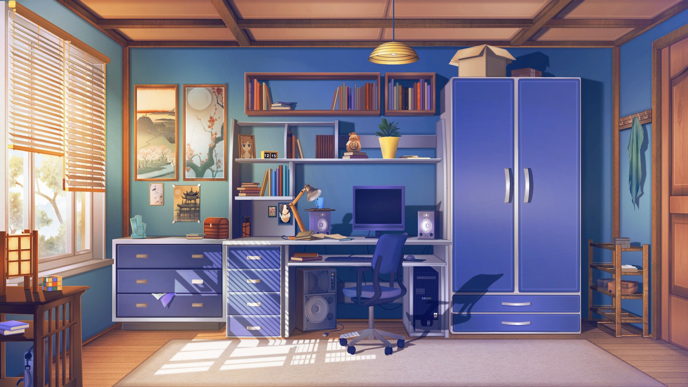
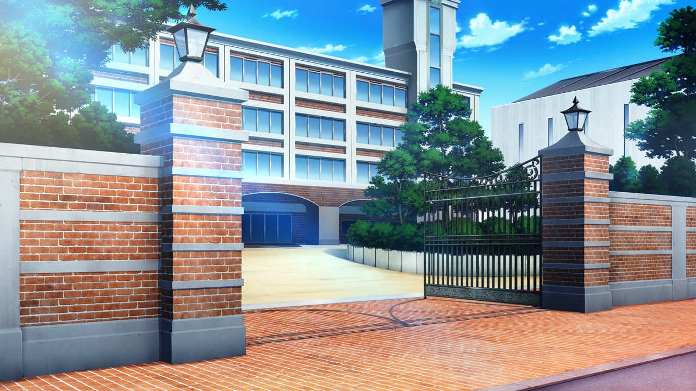

<h1>Visual Novel</h1>

<h2>Présentation</h2>
Projet de jeu vidéo de type "Visual Novel" avec l'outil <a href="http://fr.renpy.org/documentation/">Renpy 7.1.1</a> basé sur le langage Python. 
Il permet l'intégration de mini-jeux basés sur la bibliothèque "Pygame".

<h2>Fait</h2>

<h3>Son</h3>
	<h4>Musiques</h4>
	Des musiques générées avec <a href="http://tones.wolfram.com/generate/GcDu19gyJnJRb0usfw4fUfMZFOr2zGuh8oXeRlbmhm3UKM">Wolfram</a> et <a href="https://www.fesliyanstudios.com/royalty-free-music">Royalty free music</a> dont voici quelques exemples. 
	<!--
	<audio controls>
		<source src="game\images\sounds\musics\piano.mp3" type="audio/mpeg">
		
Le navigateur ne prend pas en charge l'audio HTML. Les fichiers se trouvent dans /game/images/sounds

	</audio>  
	-->
	<h4>Sons</h4>
	Récupérés sur la banque de sons gratuits <a href="http://www.universal-soundbank.com/">Universal sound</a>.

<h3>Images</h3>

<ul>
  <li>personnages</li>
  Les images de personnages sont générés via <a href="https://bebinator.com/">Bebinator</a> puis modifiés par <a href="https://krita.org/fr/">Krita</a>. 
  Chacun a 2 jeux de vêtements, 6 images avec les yeux ouverts + 6 images avec les yeux fatigués.  
	
	
	
	
  <li>Décors</li>
	Chaque décor a au moins 4 images : de jour, de nuit, aube/couché de soleil, pluie.  
	/\ Les images seront remplaçées au fil du temps. Les images non schématisées ont été récupérées sans tenir compte des droits pour un usage temporaire. 
	<ul>
		<li>salle de classe 1</li> 
			
		<li>chambre 1</li>
			
		<li>salon 1</li>
			
		<li>chambre 2</li>
			
		<li>entrée de l'école</li>
			
	</ul>
</ul>

<h3>Tests</h3>
un test des images des personnes.

<h3>Minijeux</h3>
Aucune obligation de les utiliser.  
Un minijeu de "2048" développé sous pygame est disponible dans game/subgames.

<h2>A faire</h2>

<h3>Le scénario - pistes</h3>

Histoire d'adolescents. 
Le personnage principal est un adolescent inscrit sur un forum (simulation de vie, roleplay, assistance ou les utilisateurs posent des questions du quotidien, thématique, etc ?). 
Il discute sur ce forum avec plusieurs autres adolescents qu'il ne connait pas par ailleurs. 
Il est attiré par un membre apparemment féminin du forum. (réellement feminin ou pas, on verra ^^) 

Même si on se focalise sur ses rencontres en lignes, on peut traiter quelques scènes dans son quotidien pour qu'il/elle soit plus réaliste (avec la famille par exemple), du genre, l'aprem chez mamie qui pose des questions gènantes, un contrôle stressant, etc. 

<h4>Buts/Thèmes</h4>
<ul>
	<li>découvrir les autres membres du forum IRL. Les autres membres ont des relations différentes de ce que le perso principal imagine.</li>
	<ul>
		<li>un ami à lui qui est sur le forum et qui se fait passer pour une femme car il est trans et souhaiterait changer de sexe</li>
		<li>une fille qui se fait bizuter et qui recherche un soutien moral</li>
		<li>la fille qui bizute l'autre et est également sur le forum où elle se fait passer pour une fille bizutée pour pousser les autres à la protéger</li>
	</ul>
	<li>découvrir la vie du personnage principal, son contexte, son évolution</li>
</ul>

<h3>Nom</h3>

Définir le nom du jeu. A faire après avoir établie l'histoire.

<h3>Le code</h3>

A faire après avoir établie l'histoire.
